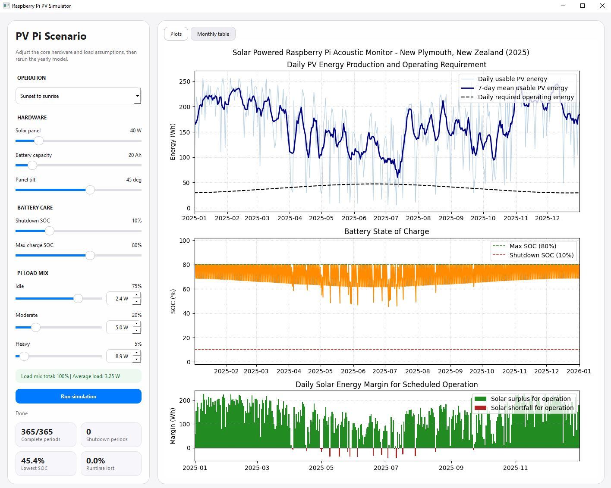

# Raspberry Pi PV Simulator UI

This project provides a PyQt6 desktop app for modelling whether a small solar
PV and LiFePO4 battery system can power a Raspberry Pi 5 acoustic monitoring
setup through a full year of historical weather.

The app is designed around repeated scenario exploration: adjust panel size,
battery capacity, operating schedule, battery SOC limits, and Raspberry Pi load
assumptions in the UI, then rerun the simulation and inspect the plots.

The hardware concept is based around the
[PV Pi board](https://www.kickstarter.com/projects/pvpi/pv-pi-power-your-raspberry-pi-with-the-sun),
a solar power board for Raspberry Pi projects associated with
[Auto Ecology](https://www.auto-ecology.com/).

## Simple Application UI

<p>
  
</p>

## Quick Start

Choose or create a parent directory for your code, then clone the repository
from GitHub:

```powershell
mkdir \code
cd \code
git clone https://github.com/cavemoa/raspi_pv_sim.git
cd raspi_pv_sim
```

Create a virtual environment and install the dependencies:

```powershell
python -m venv .venv
.\.venv\Scripts\python.exe -m pip install -r requirements.txt
```

Launch the UI:

```powershell
.\.venv\Scripts\python.exe .\raspi_pv_gui.py
```

The app reads [raspi_pv_config.yaml](./raspi_pv_config.yaml) at startup. The UI
does not currently write changed slider/spin-box values back to the YAML file.

## UI Workflow

1. Start the app with `raspi_pv_gui.py`.
2. Choose the operating mode from the drop-down.
3. Adjust hardware assumptions with the sliders.
4. Adjust the Raspberry Pi load mix with the load sliders.
5. Adjust each load state's wattage with the spin boxes.
6. Keep the load fractions summing to exactly `100%`.
7. Click **Run simulation**.
8. Review the summary cards, the three-panel plot, and the monthly table tab.

The weather data is cached locally, so after the first run for a year/location,
most UI experiments should rerun quickly.

## UI Controls

### Operation

The operation drop-down controls when the Raspberry Pi is scheduled to run:

| UI option | Model value | Meaning |
| --- | --- | --- |
| Continuous operation | `continuous` | The Pi runs all day and night. Each operating period is one local day. |
| Sunrise to sunset | `sunrise_to_sunset` | The Pi runs during daylight, from actual sunrise to sunset. |
| Sunset to sunrise | `sunset_to_sunrise` | The Pi runs overnight, from actual sunset to the next sunrise. |

The default mode is `sunset_to_sunrise`.

### Hardware

The hardware sliders control:

- Solar panel rating in watts
- Battery capacity in amp-hours
- Panel tilt in degrees

Panel azimuth is read from the YAML file. It follows PVlib convention:

- `0` = true north
- `90` = east
- `180` = south
- `270` = west

For a fixed panel in New Zealand, true north is usually the intended direction.

### Battery Care

The battery SOC sliders control:

- Shutdown SOC
- Maximum charge SOC

The simulation starts at max SOC, caps charging at max SOC, and shuts the Pi
down once the battery reaches shutdown SOC. After shutdown, no more battery
energy is drawn for the rest of that operating period.

This is intended to help compare designs that preserve LiFePO4 battery life
rather than using the full nominal battery capacity.

### Pi Load Mix

Each load row has:

- A fraction slider on the left
- A wattage spin box on the right

The wattage spin boxes move in `0.1 W` increments.

The three fractions must sum to exactly `100%`. The app shows the current total
and the calculated average load:

```text
average_w = idle_fraction * idle_power
          + moderate_fraction * moderate_power
          + heavy_fraction * heavy_power
```

That average load is applied during the selected operating schedule.

## Summary Cards

The UI displays four compact summary cards after each run:

- Complete periods
- Shutdown periods
- Lowest SOC
- Runtime lost

These are year-level summaries for the currently selected scenario.

## Plot

The results area has two tabs: **Plots** and **Monthly table**.

The **Plots** tab has three rows:

1. Daily usable PV energy production and a 7-day rolling average, with a dashed
   line showing the daily energy required by the configured operating schedule.
2. Battery SOC over time, with dashed bounds for shutdown SOC and maximum SOC.
3. Daily solar energy margin. Green bars show daily solar surplus relative to
   the operating requirement; red bars show same-day solar shortfall.

A red bar is not automatically a shutdown. Stored battery energy may carry the
system through. Shutdowns are determined by the full battery simulation.

## Monthly Table

The **Monthly table** tab shows the same month-by-month statistics produced by
the simulation script's text report:

- Complete operating periods
- Early shutdown periods
- Solar surplus days
- Days reaching max SOC
- Mean usable PV generation
- Mean operating requirement
- Mean daily margin
- Mean operating duration
- Lowest SOC
- Total unmet load
- Runtime lost
- Maximum time lost in one operating period

## Configuration File

The UI initializes from [raspi_pv_config.yaml](./raspi_pv_config.yaml). Edit this
file for defaults that should appear every time the app opens.

Current top-level sections:

```yaml
simulation:
  year: 2025
  operation_mode: sunset_to_sunrise

location:
  name: New Plymouth, New Zealand
  latitude: -39.0556
  longitude: 174.0752
  timezone: Pacific/Auckland

pv_panel:
  rated_power_w: 40.0
  tilt_deg: 45.0
  azimuth_deg: 0.0
  gamma_pdc_per_c: -0.004

battery:
  capacity_ah: 20.0
  nominal_voltage_v: 12.8
  min_soc: 0.10
  max_soc: 0.80

load_profile:
  idle:
    fraction: 0.75
    power_w: 2.4
  moderate:
    fraction: 0.20
    power_w: 5.0
  heavy:
    fraction: 0.05
    power_w: 8.9

losses:
  charge_efficiency: 0.90

weather_cache:
  enabled: true
  directory: weather_cache
  refresh: false
```

Values entered as fractions, such as `0.80`, and whole percentages, such as
`80`, are both accepted for percentage-like fields in the simulation engine.

## Weather Cache

The app uses Open-Meteo historical hourly weather. When caching is enabled in
the YAML file, downloaded weather is stored as CSV under `weather_cache/`.

The cache filename includes year, latitude, and longitude, so changing panel
size, battery size, tilt, SOC limits, operation mode, or load profile will reuse
the same weather file.

Example:

```text
weather_cache/open_meteo_2025_S39p0556_174p0752.csv
```

To force fresh weather, set this in the YAML before launching the app:

```yaml
weather_cache:
  refresh: true
```

Set it back to `false` after the refreshed file has been created.

## Modelling Details

The simulation engine is in [raspi_pv_year_sim.py](./raspi_pv_year_sim.py). The
UI calls the same simulation functions used by the script.

Open-Meteo hourly variables used:

- `shortwave_radiation`
- `direct_normal_irradiance`
- `diffuse_radiation`
- `temperature_2m`
- `wind_speed_10m`

PVlib modelling steps:

- Solar position is calculated for each hourly weather timestamp.
- Plane-of-array irradiance is calculated for the configured panel orientation.
- Cell temperature is estimated using air temperature and wind speed.
- PV output is estimated with PVWatts.
- Charge efficiency is applied before energy is added to the battery.

The operating schedule uses actual sunrise and sunset times for the configured
location and timezone.

## Assumptions and Limitations

This is a planning and scenario-comparison model, not a complete electrical
design tool.

Important assumptions:

- Raspberry Pi load is represented as a constant average load during the chosen
  operating schedule.
- The system is off outside the operating schedule except for battery charging.
- Battery capacity is modelled in watt-hours using nominal voltage.
- Detailed battery voltage curves are not modelled.
- Charge and discharge current limits are not modelled.
- MPPT and conversion losses are represented by one charge-efficiency value.
- Panel shading, soiling, horizon obstruction, cable losses, and ageing are not
  modelled separately.
- Historical weather comes from Open-Meteo gridded/reanalysis data, not from an
  on-site sensor.

For real hardware decisions, keep margin for shading, panel ageing, payload
changes, long winter cloud sequences, enclosure temperature, and practical MPPT
and battery behavior.

## Troubleshooting

If the UI fails to start, reinstall dependencies:

```powershell
.\.venv\Scripts\python.exe -m pip install -r requirements.txt
```

If the first run is slow, it may be downloading Open-Meteo weather. Later runs
for the same year and location should use the local cache.

If the **Run simulation** button is disabled, check that the idle, moderate, and
heavy load fractions sum to exactly `100%`.

If the plot looks unchanged after editing YAML, restart the UI. The YAML file is
read at app startup.
