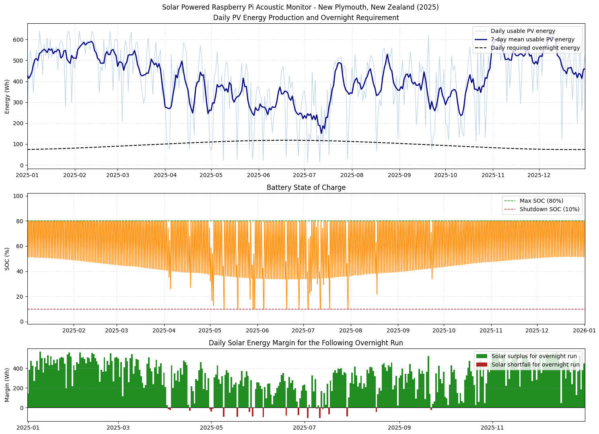

# Raspberry Pi PV Year Simulator

This project models whether a small photovoltaic system can power a Raspberry Pi
5 acoustic monitoring system from sunset to sunrise in New Plymouth, New
Zealand. It uses historical Open-Meteo weather data and PVlib to estimate hourly
PV generation, then simulates battery state of charge through a full calendar
year.

The main script is [raspi_pv_year_sim.py](./raspi_pv_year_sim.py). Runtime
parameters are normally edited in [raspi_pv_config.yaml](./raspi_pv_config.yaml)
so repeated modelling cycles can be run without long command lines.

The hardware concept is based around the
[PV Pi board](https://www.kickstarter.com/projects/pvpi/pv-pi-power-your-raspberry-pi-with-the-sun),
a solar power board for Raspberry Pi projects associated with
[Auto Ecology](https://www.auto-ecology.com/).

## Example Output

<p>
  
</p>

## What It Models

The simulator is intended for scenario testing of a Raspberry Pi 5 powered by a
small PV panel, MPPT charger, DC battery system, and LiFePO4 battery.

For each day of the selected year, the model:

1. Downloads or loads cached hourly historical weather from Open-Meteo.
2. Uses PVlib to calculate solar position for the configured site.
3. Estimates plane-of-array irradiance for the configured panel tilt and azimuth.
4. Converts irradiance to DC PV output using PVWatts.
5. Applies charge efficiency to estimate usable energy into the battery.
6. Calculates the actual sunset-to-next-sunrise operating window.
7. Draws Raspberry Pi load only during that overnight window.
8. Caps battery charging at the configured maximum SOC.
9. Shuts the system down once the battery reaches the configured minimum SOC.
10. Reports monthly reliability and generates a three-panel matplotlib plot.

The model is useful for comparing panel size, tilt, battery capacity, operating
SOC limits, and Raspberry Pi duty-cycle assumptions.

## Setup

Create and activate a Python virtual environment, then install dependencies:

```powershell
python -m venv .venv
.\.venv\Scripts\python.exe -m pip install -r requirements.txt
```

The dependencies are:

- `pvlib` for PV and solar position modelling
- `pandas` and `numpy` for time-series processing
- `matplotlib` for plotting
- `requests` for Open-Meteo API calls
- `PyYAML` for config loading

## Quick Start

Run the model using the default YAML file:

```powershell
.\.venv\Scripts\python.exe .\raspi_pv_year_sim.py --no-show
```

Run and display the plot window:

```powershell
.\.venv\Scripts\python.exe .\raspi_pv_year_sim.py --show
```

Run with a different YAML file:

```powershell
.\.venv\Scripts\python.exe .\raspi_pv_year_sim.py --config scenarios\winter_test.yaml --no-show
```

Refresh cached weather data:

```powershell
.\.venv\Scripts\python.exe .\raspi_pv_year_sim.py --refresh-weather-cache --no-show
```

## Configuration

Edit [raspi_pv_config.yaml](./raspi_pv_config.yaml) for normal use.

Percentages can be written as fractions, such as `0.80`, or whole percentages,
such as `80`.

### Simulation

```yaml
simulation:
  year: 2025
```

This is the calendar year to simulate. The script fetches one extra day of
weather so the final night, December 31 sunset to January 1 sunrise, can be
modelled correctly.

### Location

```yaml
location:
  name: New Plymouth, New Zealand
  latitude: -39.0556
  longitude: 174.0752
  timezone: Pacific/Auckland
```

The timezone is used for local sunset, sunrise, daily summaries, and plots.
Open-Meteo data is fetched in UTC and converted locally by the script.

### PV Panel

```yaml
pv_panel:
  rated_power_w: 100.0
  tilt_deg: 45.0
  azimuth_deg: 0.0
  gamma_pdc_per_c: -0.004
```

`rated_power_w` is the panel rating used as PVWatts `pdc0`.

`tilt_deg` is panel inclination from horizontal.

`azimuth_deg` follows PVlib convention:

- `0` = true north
- `90` = east
- `180` = south
- `270` = west

For a fixed panel in New Zealand, true north is typically the desired direction.

`gamma_pdc_per_c` is the PV temperature coefficient. A typical crystalline
silicon value is around `-0.004` per degree C.

### Battery

```yaml
battery:
  capacity_ah: 20.0
  nominal_voltage_v: 12.8
  min_soc: 0.10
  max_soc: 0.80
```

The nominal battery capacity is:

```text
capacity_ah * nominal_voltage_v
```

The model only uses the operating SOC window between `min_soc` and `max_soc`.
With a `20 Ah`, `12.8 V` battery and a `10%` to `80%` operating window:

```text
Nominal capacity = 256 Wh
Operating window = 179 Wh
```

Battery behavior:

- The simulation starts at `max_soc`.
- Charging stops at `max_soc`.
- Overnight load can only discharge down to `min_soc`.
- Once `min_soc` is reached, the Pi is treated as shut down for the rest of
  that sunset-to-sunrise period.
- After shutdown, no additional battery energy is drawn that night.
- The following day can recharge the battery for the next night.

This makes the model suitable for designing around battery longevity rather
than using the full nominal battery capacity.

### Load Profile

```yaml
load_profile:
  idle:
    fraction: 0.25
    power_w: 3.5
  moderate:
    fraction: 0.25
    power_w: 6.0
  heavy:
    fraction: 0.5
    power_w: 11.5
```

The fractions must sum to `1.0` or `100%`.

The script converts this into a single average Raspberry Pi power draw:

```text
average_w = idle_fraction * idle_power
          + moderate_fraction * moderate_power
          + heavy_fraction * heavy_power
```

That average load is applied for every hour, or partial hour, between sunset
and sunrise.

### Losses

```yaml
losses:
  charge_efficiency: 0.90
```

This is applied to model losses between PV DC output and useful battery charge,
including MPPT and conversion losses.

### Weather Cache

```yaml
weather_cache:
  enabled: true
  directory: weather_cache
  refresh: false
```

When enabled, Open-Meteo hourly weather data is saved as CSV under the cache
directory. The filename includes year, latitude, and longitude, so changing
panel size, battery size, tilt, SOC limits, or load profile will reuse the same
weather file.

Example cache file:

```text
weather_cache/open_meteo_2025_S39p0556_174p0752.csv
```

Set `refresh: true` in YAML or use `--refresh-weather-cache` to replace the
cached weather file.

### Output

```yaml
output:
  save_plot: outputs/raspi_pv_2025.png
  show_plot: true
```

`save_plot` can be a path or blank/null if you do not want to save the figure.

`show_plot` controls whether matplotlib opens the figure window. For repeated
batch-style runs, set this to `false` or pass `--no-show`.

## Command-Line Overrides

YAML is the main interface, but most settings can be overridden from the command
line for quick experiments.

Examples:

```powershell
.\.venv\Scripts\python.exe .\raspi_pv_year_sim.py --panel-w 50 --battery-ah 50 --no-show
```

```powershell
.\.venv\Scripts\python.exe .\raspi_pv_year_sim.py --min-soc 10 --max-soc 80 --no-show
```

```powershell
.\.venv\Scripts\python.exe .\raspi_pv_year_sim.py --idle-pct 50 --moderate-pct 40 --heavy-pct 10 --no-show
```

Useful flags:

| Flag | Purpose |
| --- | --- |
| `--config PATH` | Load a specific YAML config file |
| `--year YEAR` | Override simulation year |
| `--panel-w WATTS` | Override PV panel rating |
| `--tilt DEGREES` | Override panel tilt |
| `--azimuth DEGREES` | Override panel azimuth |
| `--battery-ah AH` | Override battery capacity |
| `--battery-voltage VOLTS` | Override battery nominal voltage |
| `--min-soc VALUE` | Override shutdown SOC |
| `--max-soc VALUE` | Override charge cap SOC |
| `--idle-pct VALUE` | Override idle fraction |
| `--moderate-pct VALUE` | Override moderate-load fraction |
| `--heavy-pct VALUE` | Override heavy-load fraction |
| `--refresh-weather-cache` | Download weather again and update cache |
| `--no-weather-cache` | Disable weather cache for this run |
| `--save-plot PATH` | Save plot to a specific path |
| `--show` | Open matplotlib plot window |
| `--no-show` | Do not open matplotlib plot window |

## Text Output

The script prints one monthly block for each month.

Core monthly statistics include:

- Sufficient sunset-to-sunrise nights
- Early shutdown nights
- Days with solar energy surplus
- Days battery reached max SOC
- Mean usable PV generation
- Mean overnight energy requirement
- Mean daily energy margin
- Mean night duration
- Lowest overnight battery SOC
- Total unmet load

For months that have at least one early shutdown, the report also includes:

- Operating time lost to shutdowns
- Maximum time lost on a single night

The lost-time metrics are calculated by converting unmet Wh back to hours using
the configured average Raspberry Pi load.

## Plot Output

The generated plot has three rows:

1. Daily usable PV energy production and a 7-day rolling average, with a dashed
   line showing the daily energy required to power the Raspberry Pi overnight.
2. Battery SOC over time, with dashed lines for maximum SOC and shutdown SOC.
3. Daily solar energy margin for the following overnight run. Green bars show
   days where daily solar energy exceeded that night's requirement; red bars
   show days with a same-day solar shortfall.

The third plot is a daily energy margin view, not a direct shutdown indicator.
A red bar does not necessarily mean the system shut down, because stored battery
energy may carry the system through. The monthly early-shutdown statistics are
based on the full battery simulation.

## Weather and PV Modelling Details

Open-Meteo hourly variables used:

- `shortwave_radiation`
- `direct_normal_irradiance`
- `diffuse_radiation`
- `temperature_2m`
- `wind_speed_10m`

PVlib modelling steps:

- Solar position is calculated for every hourly weather timestamp.
- Plane-of-array irradiance is calculated with `pvlib.irradiance.get_total_irradiance`.
- Cell temperature is estimated with `pvlib.temperature.pvsyst_cell`.
- PV output is estimated with `pvlib.pvsystem.pvwatts_dc`.

Open-Meteo wind speed is supplied in km/h and converted to m/s before being
passed to the PVlib cell-temperature model.

## Assumptions and Limitations

The model is intentionally simple and scenario-oriented.

Important assumptions:

- Raspberry Pi load is represented as a constant average load during the night.
- The system is off during the day except for charging.
- Battery voltage is treated as nominal and energy-based, not a detailed voltage
  curve.
- Charge/discharge current limits are not modelled.
- MPPT behavior is simplified into a single charge-efficiency factor.
- Panel soiling, shading, cable losses, snow, and horizon obstruction are not
  modelled separately.
- The PV panel is assumed fixed at the configured tilt and azimuth.
- Historical weather is taken from Open-Meteo's gridded/reanalysis source, not
  from an on-site pyranometer.

For hardware decisions, treat the results as a planning model. A real deployment
should include margin for shading, panel ageing, sensor payload changes, winter
cloud sequences, and MPPT/battery behavior at low temperatures.

## Suggested Scenario Workflow

1. Set `weather_cache.enabled: true`.
2. Run once to download/cache weather.
3. Duplicate `raspi_pv_config.yaml` into a scenario-specific YAML file.
4. Change one variable at a time, such as panel wattage, battery capacity, tilt,
   or load profile.
5. Run with `--config scenario_file.yaml --no-show`.
6. Compare monthly early shutdowns, lost runtime, minimum SOC, and saved plots.

Example:

```powershell
Copy-Item .\raspi_pv_config.yaml .\scenario_50w_50ah.yaml
.\.venv\Scripts\python.exe .\raspi_pv_year_sim.py --config .\scenario_50w_50ah.yaml --no-show
```

## Troubleshooting

If YAML loading fails, ensure dependencies are installed:

```powershell
.\.venv\Scripts\python.exe -m pip install -r requirements.txt
```

If Open-Meteo returns an error, try again later or run using already cached
weather data.

If you change year or location and want fresh weather:

```powershell
.\.venv\Scripts\python.exe .\raspi_pv_year_sim.py --refresh-weather-cache --no-show
```

If the plot window blocks automated runs:

```powershell
.\.venv\Scripts\python.exe .\raspi_pv_year_sim.py --no-show
```
